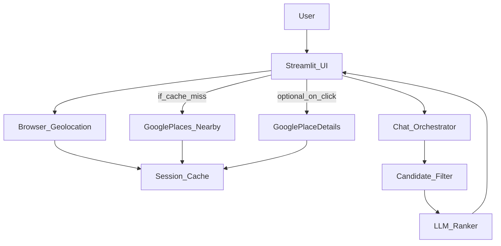

## Goals (new architecture)

- **Location-first UX**: on Streamlit load, request browser geolocation with permission + provide a manual fallback.
- **On-demand places ingestion**: query Google Places API for **nearby** places around user location and keep a **session-only cache**.
- **Lightweight retrieval**: filter/rank a small nearby candidate set using heuristics + an LLM ranking prompt (no Qdrant for MVP).
- **Clear separation of concerns**: UI, location, Google client, storage/cache, ranking, and conversation orchestration in distinct modules.

## What does / doesn’t make sense in the new idea (trade-offs)

- **Makes sense for MVP**
  - Session-only caching keeps complexity low and avoids running Redis/Mongo during early iteration.
  - Nearby search reduces the candidate pool, so vector DB isn’t necessary at first.
- **Main risks to plan for (even in MVP)**
  - **Latency/cost**: Google calls + details/reviews can be slow/expensive if done per user message. Fix by: fetch a bounded set once per session; defer expensive details until needed.
  - **Data richness**: your current pipeline expects fields like `summary`/`reviews` in Mongo. Nearby results won’t have those unless you call Place Details or you generate summaries.
  - **Geolocation reliability**: browser geolocation requires HTTPS and user consent; you need a fallback input.

## Proposed high-level flow

## New module boundaries (mapped to current code)

- **UI** (currently `[prototype/app.py](/Users/guilhermeluz/Desktop/Pandora/projects/localwhisper/localwhisper/prototype/app.py)`)
  - Add a “Get my location” step and show status (granted/denied/manual).
  - Keep chat UI roughly the same.
- **Chat orchestration** (currently `[prototype/main.py](/Users/guilhermeluz/Desktop/Pandora/projects/localwhisper/localwhisper/prototype/main.py)`)
  - Replace Qdrant+Mongo retrieval with retrieval over the session’s nearby candidates.
- **Location service** (new)
  - `get_user_location()` implemented via a Streamlit component that calls `navigator.geolocation.getCurrentPosition()`.
  - Manual fallback: address search or lat/lng input.
- **Google Places service** (refactor from `[dba/google_api/get_places.py](/Users/guilhermeluz/Desktop/Pandora/projects/localwhisper/localwhisper/dba/google_api/get_places.py)`)
  - Use **Nearby Search** semantics (lat/lng + radius + type/keyword).
  - Implement `fetch_nearby_places(lat,lng,radius,filters)` and a separate `fetch_place_details(place_id)`.
- **Session cache** (new)
  - `st.session_state.nearby_places` keyed by `(lat,lng,radius,types,keyword)` + a timestamp, with a simple freshness window.
- **Ranking** (new, lightweight)
  - Heuristic pre-filter: distance, open_now, min rating, price_level, types.
  - LLM ranking: provide the LLM a compact JSON list of candidates (top N) and ask for a ranked shortlist + rationale.

## Suggested repo restructure (no behavior change yet, just organization)

- `localwhisper/` (Python package)
  - `ui/streamlit_app.py`
  - `services/location.py`
  - `services/google_places.py`
  - `domain/models.py` (PlaceCandidate dataclass / pydantic model)
  - `retrieval/rank.py`
  - `pipeline/chat.py` (orchestrator)
  - `config.py` (env var names centralized)
- `scripts/` (old `dba/` ingestion scripts kept but separated)
- `notebooks/` (move `.ipynb` out of `dba/` eventually)
- `prototype/` can be deleted later once `ui/streamlit_app.py` supersedes it.

## Migration approach (incremental, low-risk)

- Keep your existing agent prompts (`Agents.IntentionAgent`, `Agents.DetailAgent`, `Agents.ResponseAgent` in `[prototype/pipeline/agents.py](/Users/guilhermeluz/Desktop/Pandora/projects/localwhisper/localwhisper/prototype/pipeline/agents.py)`), but swap the retrieval source.
- First milestone: **nearby places appear in UI** and are cached in session.
- Second milestone: chat answers using nearby candidates.
- Third milestone (optional): lazy Place Details enrichment when the user asks “tell me more / is it well rated / website?”.
- Later (post-MVP): add Redis TTL caching and/or reintroduce vectors if you outgrow LLM ranking.

